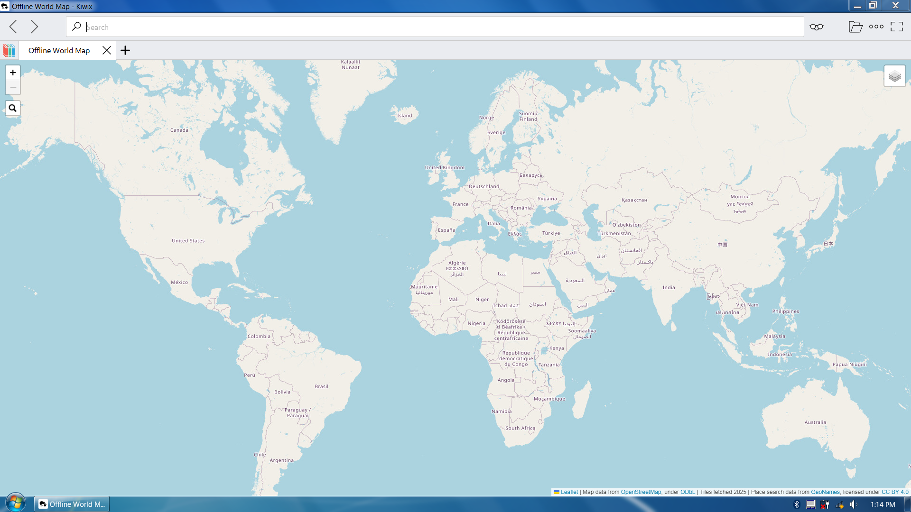
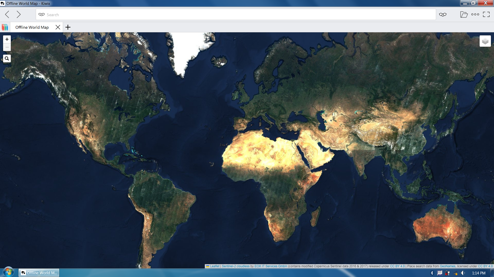
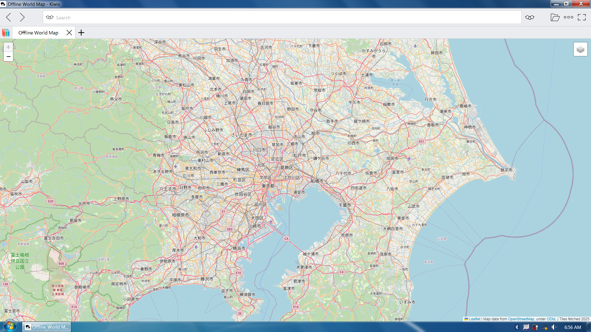
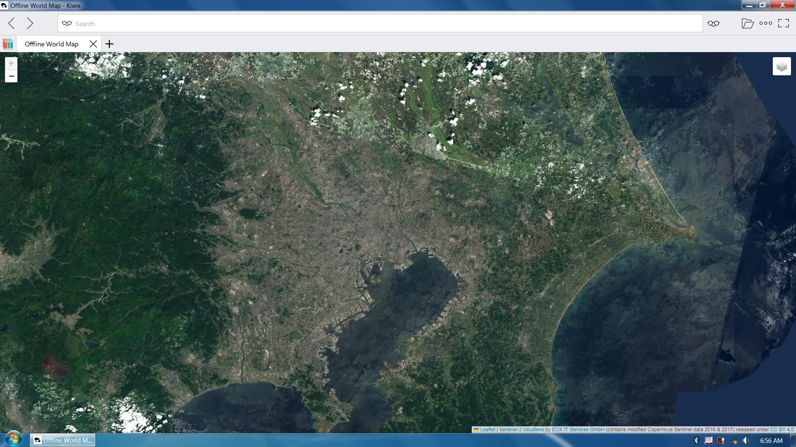

# Offline World Map for Kiwix (.ZIM)

This project provides an **offline, interactive world map** packaged as a single **ZIM file** for use with **Kiwix**.

It demonstrates that the ZIM file format can be used not only for wiki-style content, but also to deliver a fully interactive, pan-and-zoom world map using standard web technologies.

## What this is

The Offline World Map is a self-contained map application bundled inside a single `.zim` file.  
When opened in Kiwix, it behaves like a website that works entirely offline.

It includes:

- OpenStreetMap-based map tiles
- Sentinel-2 cloudless satellite imagery
- A Leaflet-based JavaScript map viewer

## Why ZIM instead of traditional offline map formats?

Most offline maps are distributed as MBTiles, vector databases, or app-specific formats.  
This project explores a different approach: using **ZIM as an offline web container**.

Advantages:

- Single-file distribution
- Works on all platforms supported by Kiwix (desktop and mobile)
- No dedicated map application required
- Easy to archive and share

## Features

- Global coverage
- Multiple zoom levels
- Map and satellite imagery layers
- Fully offline pan-and-zoom navigation
- Runs inside the Kiwix reader

## Downloads

The ZIM file is available here:

- **Gumroad:** [Offline World Map – ZIM file](https://anthonykaram.gumroad.com/l/offline_world_map)

## Videos

- **Overview (v4):** [Offline World Map for Kiwix](https://youtu.be/XYoBKyg8tH4)
- **Early prototype (v1):** [Initial proof of concept](https://youtu.be/5qq_W7qMxxs)

## Licensing and attribution

This project is a compilation and packaging effort.  
Individual components are licensed separately:

- OpenStreetMap data © OpenStreetMap contributors (ODbL)
- Satellite imagery: Sentinel-2 cloudless (CC BY 4.0, EOX IT Services GmbH)
- Leaflet © Vladimir Agafonkin and contributors (BSD 2-Clause)

Compilation, integration, and packaging © Anthony Karam.

---

## Project metadata

- **Project name:** Offline World Map
- **Format:** ZIM file
- **Platform:** Kiwix (desktop and mobile)
- **Category:** Offline maps / geographic reference
- **Technologies:** Leaflet, OpenStreetMap, Sentinel-2
- **Author:** Anthony Karam
- **Canonical URL:** [https://anthonykaram.github.io/offline-world-map/](https://anthonykaram.github.io/offline-world-map/)
